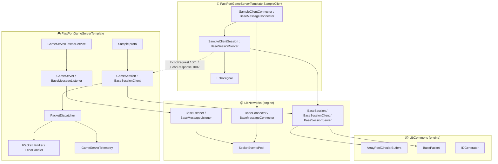
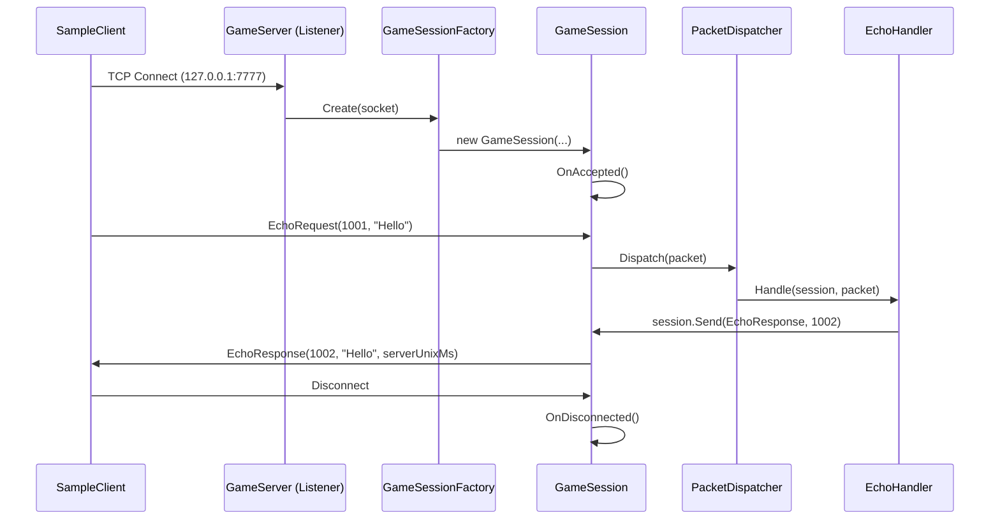

# 🚀 FastPortSharp

**고성능 .NET 10 TCP 엔진 + 게임 서버 스타터 템플릿**

[English](README.md) | 한국어

FastPortSharp는 10K 동시 세션을 검증한 `SocketAsyncEventArgs` 기반 TCP 엔진과
바로 부트스트랩 가능한 게임 서버 템플릿을 한 묶음으로 제공합니다. 본 레포를
GitHub Template Repository로 사용해 수 분 안에 새 C# / .NET 10 게임 서버를
시작하세요. 소켓·버퍼·프레이밍이 아니라 게임 로직에만 집중할 수 있습니다.

---

## 📋 목차

- [프로젝트 개요](#-프로젝트-개요)
- [게임 서버 템플릿](#-게임-서버-템플릿)
- [주요 기능](#-주요-기능)
- [기술 스택](#-기술-스택)
- [성능 벤치마크](#-성능-벤치마크)
- [리포트](#-리포트)
- [아키텍처](#-아키텍처)
- [프로젝트 구조](#-프로젝트-구조)
- [핵심 구현](#-핵심-구현)
- [시작하기](#-시작하기)
- [라이선스](#-라이선스)

---

## 🎯 프로젝트 개요

FastPortSharp는 두 개의 레이어로 구성됩니다.

- **엔진** (`LibCommons` + `LibNetworks`) — 10K 동시 세션을 실측 검증한
  protocol-neutral TCP listener / session / connector 프리미티브.
  `SocketAsyncEventArgs` IOCP, `Channel<T>`, ArrayPool 기반 순환 버퍼,
  .NET 10 경량 `Lock`을 사용합니다.
- **게임 서버 템플릿** (`FastPortGameServerTemplate` +
  `FastPortGameServerTemplate.SampleClient`) — Generic Host + Serilog +
  Protobuf + session / handler / dispatcher 트리오가 미리 wired-up 된
  스타터. 자신의 `.proto` 파일과 핸들러만 추가하면 게임 서버가 됩니다.

### 개발 동기

- 대규모 동시 접속 환경에서의 안정적인 네트워크 처리
- 어떤 .NET 호스트에도 임베드 가능한 모듈화된 엔진 컴포넌트
- 호스팅 / 프레이밍 / 텔레메트리 hook 같은 핵심 결정만 정해두고 나머지는
  비-침습적으로 비워둔 "0 → 1 게임 서버" 출발 경로

---

## 🎮 게임 서버 템플릿

`FastPortGameServerTemplate/`은 검증된 TCP 엔진(`LibCommons` + `LibNetworks`)
위에서 새 게임 서버를 만들기 위한 스타터 프로젝트입니다. Generic Host,
Serilog, Protobuf, session / handler / dispatcher 트리오가 미리 wired-up
되어 있어 보일러플레이트 대신 게임 로직에 집중할 수 있습니다.

### 기본 제공 구성

| 영역 | 구현 |
|---|---|
| Hosting | `Microsoft.Extensions.Hosting` (`Host.CreateApplicationBuilder`) |
| Logging | Serilog Console sink, `appsettings.json`에서 구성 |
| Listener | `GameServer : LibNetworks.BaseMessageListener` |
| Per-session | `GameSession : LibNetworks.Sessions.BaseSessionClient` |
| Dispatch | `PacketDispatcher`가 packet id → `IPacketHandler` 라우팅 |
| Sample protocol | `Sample.proto` (Grpc.Tools, `GrpcServices=None`) — `EchoRequest` (1001) / `EchoResponse` (1002) |
| Telemetry hook | `IGameServerTelemetry` + `NullGameServerTelemetry` (DI로 교체) |
| Sample client | `FastPortGameServerTemplate.SampleClient/` — full echo round-trip 검증 |
| Config | `appsettings.json` → `GameServerOptions` (listen address / port / max sessions) |

템플릿은 **오직** `LibCommons` + `LibNetworks`만 참조합니다.
`FastPortServer`, `FastPortClient`, `Protocols/`, 테스트 프로젝트는
참조하지 않으므로 엔진 boundary가 깔끔하고 게임 서버 코드에 테스트 비계가
섞이지 않습니다.

### Quickstart

```bash
# 1. 솔루션 전체 빌드
dotnet build FastPortSharp.sln -c Release

# 2. 템플릿 서버 실행 (터미널 1)
dotnet run --project template-projects/FastPortGameServerTemplate -c Release
# → "GameServer listening" on 0.0.0.0:7777

# 3. Full Protobuf echo round-trip 검증 (터미널 2)
dotnet run --project template-projects/FastPortGameServerTemplate.SampleClient -c Release
# → "EchoResponse received. Message=\"Hello, FastPort!\", RTT=...ms"
```

Listen 주소 / 포트 / 최대 세션 수는
`FastPortGameServerTemplate/appsettings.json`에서 설정합니다.

### 서버 커스터마이징

1. **새 패킷 추가** — `FastPortGameServerTemplate/Protocols/`에 `.proto`를
   추가합니다. `dotnet build` 시 Grpc.Tools가 C# 클래스를 자동 생성합니다.
   새 packet id를 `Handlers/PacketIds.cs`에 추가 (사용자 정의는 `≥ 2000` 권장).

2. **핸들러 구현**:

   ```csharp
   public sealed class MyHandler : IPacketHandler
   {
       public int PacketId => PacketIds.MyRequest;
       public void Handle(GameSession session, BasePacket packet) { /* ... */ }
   }
   ```

3. **`Program.cs`에 등록**:

   ```csharp
   builder.Services.AddSingleton<IPacketHandler, MyHandler>();
   ```

4. **텔레메트리 hook 교체**: 자체 `IGameServerTelemetry` 구현(예:
   OpenTelemetry 백엔드)으로 `Program.cs`의 DI 등록을 덮어쓰면 됩니다.

5. **버퍼 크기 튜닝**: `Sessions/GameSessionFactory.cs`의
   `BufferCapacityBytes` (기본 `8 KiB` — 10K 세션 검증 컨피그와 동일)를
   필요에 맞게 조정.

### 배포

본 레포가 게임 서버 템플릿의 GitHub Template Repository입니다. GitHub의
**"Use this template"** 버튼을 누르거나 `git clone` / `fork` 후 필요 없는
프로젝트를 prune 하세요. **엔진을 nuget.org에 업로드하는 것은 의도적으로
out of scope**입니다 — 같은 솔루션 안에서 `ProjectReference`로 엔진을
재사용하거나, 레포 자체를 클론하는 두 가지 길이 권장됩니다.

#### 새 프로젝트 한 번에 부트스트랩 (scaffold)

자기완결적인 새 체크아웃(서버 + 엔진만, 템플릿 토큰이 프로젝트명으로
치환된 상태)으로 바로 시작하고 싶다면, cross-platform scaffold 스크립트를
사용하세요:

```bash
# Linux / macOS
scripts/scaffold-game-server.sh   MyLobbyServer ../my-lobby

# Windows / cross-platform
pwsh -File scripts/scaffold-game-server.ps1 MyLobbyServer ../my-lobby
```

`FastPortGameServerTemplate/` + `LibCommons/` + `LibNetworks/`를 대상
경로로 복사하고, `FastPortGameServerTemplate` 토큰을 지정한 이름으로
일괄 치환한 뒤 `<이름>.sln` 생성, `git init`, `dotnet build` smoke까지
한 번에 수행합니다. 옵션(`--force`, `--no-git`, `--dry-run`,
`--skip-smoke`)과 exit code는 `scripts/README.md` 참고.

전체 step-by-step 가이드는
`FastPortGameServerTemplate/README.md`(영문)와
`FastPortGameServerTemplate/QUICKSTART.ko.md`(한국어) 참고.

---

## ✨ 주요 기능

| 기능 | 설명 |
|------|------|
| **비동기 I/O** | `SocketAsyncEventArgs` 기반 IOCP 패턴으로 높은 동시성 처리 |
| **순환 버퍼** | ArrayPool 기반 순환 버퍼로 지속 처리량에서 GC 압박 최소화 |
| **Channel\<T\>** | 수신/송신 파이프라인에 bounded `Channel<T>` — `BufferBlock<T>` 대비 4배 빠름 / 메모리 69% 절약 |
| **Protocol Buffers** | Grpc.Tools로 생성되는 Google Protobuf 기반 메시지 직렬화 |
| **세션 관리** | Factory 패턴 기반 유연한 세션 생성/관리 |
| **Keep-Alive** | TCP Keep-Alive를 통한 연결 상태 모니터링 |
| **Generic Host** | 서버/클라이언트 모두 `Microsoft.Extensions.Hosting` 라이프사이클 사용 |
| **게임 서버 템플릿** | Serilog + Protobuf + session/handler/dispatcher가 미리 wired-up 된 스타터 |
| **Latency 통계** | 실시간 RTT/서버 처리 시간/네트워크 지연 측정 (load runner) |

---

## 🛠 기술 스택

| 영역 | 기술 |
|------|------|
| Language | C# 14 / .NET 10 |
| Async Pattern | SocketAsyncEventArgs (IOCP) |
| Concurrency | **Channel\<T\>**, .NET 10 `Lock` |
| Serialization | Google Protocol Buffers + Grpc.Tools (gen, gRPC 런타임 미사용) |
| DI Container | Microsoft.Extensions.DependencyInjection |
| Hosting | Microsoft.Extensions.Hosting (Generic Host) |
| Logging | Serilog (템플릿) / Microsoft.Extensions.Logging |
| Testing | MSTest, FastPortTestLoadRunner, FastPortTestLoadValidation |

---

## 📊 성능 벤치마크

> **측정 환경**: Windows 11, Intel Core i5-14600K 3.50GHz, .NET 10

### 핵심 성능 지표

| 항목 | 결과 | 비고 |
|------|------|------|
| **CircularBuffer Write** | 244~670 ns | 64B~8KB 데이터 |
| **CircularBuffer vs QueueBuffer** | **20배 빠름** | 4KB 데이터 기준 |
| **Channel vs BufferBlock** | **4배 빠름** | 메모리 69% 절약 |
| **.NET 10 Lock vs lock** | **9% 빠름** | 10,000 iterations 기준 |

### 📈 상세 벤치마크 결과

👉 **[전체 벤치마크 결과 보기](docs/baseline-benchmark-results.md)**

👉 **[10K 부하 검증 결과 보기](docs/load-validation-benchmark-results.md)**

### 부하 테스트 실행

```bash
dotnet run -c Release --project tests-projects/FastPortTestLoadRunner -- --sessions 10000 --payload random:4096-16384 --duration 5m --ramp-up 60s
```

---

## 📑 리포트

### 성능 테스트 리포트

| 리포트 | 설명 | 링크 |
|--------|------|------|
| **개선 전 퍼포먼스 리포트** | 최적화 전 Latency 성능 테스트 결과 | [📄 보기](docs/latency-performance-report.md) |
| **Lock 개선 후 퍼포먼스 리포트** | ArrayPool + .NET 10 Lock 적용 후 성능 테스트 | [📄 보기](docs/latency-performance-report-after-lock.md) |
| **Channel 적용 후 퍼포먼스 리포트** | 전체 최적화 적용 후 성능 테스트 | [📄 보기](docs/latency-performance-report-after-channel.md) |
| **기존 벤치마크 결과** | LoadRunner 전환 전에 측정한 컴포넌트별 micro benchmark 결과 | [📄 보기](docs/baseline-benchmark-results.md) |
| **10K 부하 검증 결과** | server send backpressure 최적화 전후 same-machine 10K 비교 | [📄 보기](docs/load-validation-benchmark-results.md) |

### 최적화 효과 요약

| 지표 | 개선 전 | 최종 (Channel 적용) | 개선율 |
|------|--------|---------------------|--------|
| 평균 RTT | 96.03 ms | 55.68 ms | **42.0%↓** |
| 서버 처리 시간 | 0.234 ms | 0.002 ms | **99.1%↓** |
| 최대 RTT | 434.40 ms | 83.13 ms | **80.9%↓** |
| 처리량 | ~489/분 | ~1,080/분 | **2.2배↑** |

---

## 🏗 아키텍처

### 전체 시스템 구조



### 서버 연결 흐름 (템플릿)



> 엔진 검증 프로젝트들 (`FastPortServer`, `FastPortClient`,
> `FastPortTestSmokeServer`, `FastPortTestLoadRunner`,
> `FastPortTestLoadValidation`, `FastPortTests`)도 동일한 엔진
> 프리미티브를 사용하지만 템플릿과는 별도로 존재합니다 — 아래 프로젝트
> 구조 참고.

---

## 📁 프로젝트 구조

```
FastPortSharp/
├── 📂 LibCommons/                            # 엔진: 버퍼/패킷/ID
│   ├── BaseCircularBuffers.cs                 # 순환 버퍼 (.NET 10 Lock)
│   ├── ArrayPoolCircularBuffers.cs            # ArrayPool 기반 순환 버퍼
│   ├── BasePacket.cs                          # 패킷 구조체
│   ├── IBuffers.cs                            # 버퍼 인터페이스
│   ├── IDGenerator.cs                         # 세션/요청 ID 생성기
│   └── LatencyStats.cs                        # Latency 통계 (load runner용)
│
├── 📂 LibNetworks/                           # 엔진: TCP listener / session / connector
│   ├── BaseListener.cs / BaseMessageListener.cs
│   ├── BaseConnector.cs / BaseMessageConnector.cs
│   ├── SocketEventsPool.cs
│   ├── Extensions/BasePacket+Extensions.cs    # ParseMessageFromPacket<T>
│   └── 📂 Sessions/
│       ├── BaseSession.cs                      # Channel<T> + ArrayPool framing
│       ├── BaseSessionClient.cs                # 서버 측 accepted 세션
│       ├── BaseSessionServer.cs                # 클라이언트 측 outgoing 세션
│       └── IClientSessionFactory.cs
│
├── 📂 template-projects/                      # 게임 서버 템플릿 surface 그룹화
│   ├── 🎮 FastPortGameServerTemplate/          # 게임 서버 스타터 (템플릿)
│   │   ├── Application/
│   │   │   ├── GameServer.cs                   # : BaseMessageListener
│   │   │   ├── GameServerHostedService.cs      # IHostedService 라이프사이클
│   │   │   └── PacketDispatcher.cs
│   │   ├── Sessions/
│   │   │   ├── GameSession.cs                  # : BaseSessionClient
│   │   │   └── GameSessionFactory.cs
│   │   ├── Handlers/
│   │   │   ├── IPacketHandler.cs
│   │   │   ├── EchoHandler.cs                  # 1001 → 1002 round-trip 샘플
│   │   │   └── PacketIds.cs
│   │   ├── Telemetry/
│   │   │   ├── IGameServerTelemetry.cs
│   │   │   └── NullGameServerTelemetry.cs
│   │   ├── Configuration/GameServerOptions.cs
│   │   ├── Protocols/Sample.proto              # Grpc.Tools, GrpcServices=None
│   │   ├── Program.cs                          # Generic Host + Serilog wiring
│   │   ├── appsettings.json
│   │   ├── README.md / QUICKSTART.ko.md
│   │   └── FastPortGameServerTemplate.csproj
│   │
│   └── 🧪 FastPortGameServerTemplate.SampleClient/  # Full echo round-trip 검증
│       ├── Sessions/
│       │   ├── SampleClientSession.cs          # : BaseSessionServer
│       │   └── SampleClientSessionFactory.cs
│       ├── SampleClientConnector.cs            # : BaseMessageConnector
│       ├── SampleClientHostedService.cs        # connect → 1001 → 1002 await
│       ├── SampleClientOptions.cs / EchoSignal.cs
│       ├── Program.cs / appsettings.json
│       └── FastPortGameServerTemplate.SampleClient.csproj
│
├── 📂 FastPortServer/                        # 엔진 sample/host (검증)
├── 📂 FastPortClient/                        # 엔진 sample/client (LatencyStats)
├── 📂 Protocols/                             # 엔진 내부 sample 프로토콜
├── 📂 tests-projects/                        # 테스트 surface 그룹화
│   ├── FastPortTestSmokeServer/              # smoke/echo 테스트 서버
│   ├── FastPortTestLoadRunner/               # 10K 세션 부하 runner
│   ├── FastPortTestLoadValidation/           # 부하 검증 harness
│   ├── FastPortTests/                        # MSTest 단위 테스트 (139 cases)
│   └── LibTestTelemetry/                     # 테스트 전용 텔레메트리 contract (JSONL)
│
├── 📂 FastPortDashboard.Maui/                # MAUI desktop dashboard (macOS / Windows)
│                                              # FastPortSharp.Dashboard.sln 로 빌드
│
├── 📂 docs/                                  # 성능 리포트, PDCA archive
└── FastPortSharp.sln
```

---

## 🔧 핵심 구현

### 1. 순환 버퍼 (Circular Buffer)

메모리 재할당 없이 연속적인 데이터 스트림을 효율적으로 처리합니다.

```csharp
public class BaseCircularBuffers : IBuffers, IDisposable
{
    private byte[] m_Buffers;
    private int m_Head = 0;  // 읽기 위치
    private int m_Tail = 0;  // 쓰기 위치

    // .NET 10 경량 Lock 사용
    private readonly Lock m_Lock = new();

    public int Write(byte[] buffers, int offset, int count)
    {
        lock (m_Lock)
        {
            // 용량 부족 시 자동 확장
            // 순환 쓰기 로직으로 메모리 효율화
        }
    }
}
```

### 2. Channel\<T\> 기반 패킷 처리

고성능 비동기 메시지 전달을 위해 `Channel<T>`를 사용합니다.

```csharp
// BufferBlock<T> 대비 4배 빠르고 메모리 69% 절약
private readonly Channel<BasePacket> m_ReceivedPackets =
    Channel.CreateBounded<BasePacket>(new BoundedChannelOptions(1000)
    {
        FullMode = BoundedChannelFullMode.Wait,
        SingleReader = true,
        SingleWriter = true
    });

await foreach (var packet in m_ReceivedPackets.Reader.ReadAllAsync(cancellationToken))
{
    OnReceived(packet);
}
```

### 3. Factory 패턴 기반 세션 생성

```csharp
public interface IClientSessionFactory
{
    BaseSessionClient Create(Socket socket);
}

// 템플릿의 GameSessionFactory: session + dispatcher + telemetry 한꺼번에 wiring
public sealed class GameSessionFactory : IClientSessionFactory
{
    public BaseSessionClient Create(Socket clientSocket) => new GameSession(
        m_Logger, clientSocket,
        new ArrayPoolCircularBuffers(8 * 1024),
        new ArrayPoolCircularBuffers(8 * 1024),
        m_Dispatcher, m_Telemetry);
}
```

### 4. 템플릿의 Protobuf round-trip

```csharp
// 서버 (EchoHandler)
public void Handle(GameSession session, BasePacket packet)
{
    if (!packet.ParseMessageFromPacket<EchoRequest>(out _, out var request) || request is null) return;
    var response = new EchoResponse
    {
        Message = request.Message,
        ServerUnixMs = DateTimeOffset.UtcNow.ToUnixTimeMilliseconds(),
    };
    session.Send(PacketIds.EchoResponse, response);
}

// 클라이언트 (SampleClientSession.OnConnected)
RequestSendMessage(PacketIds.EchoRequest, new EchoRequest { Message = "Hello, FastPort!" });
```

### 5. Wire framing

```text
[ 2-byte length header ][ int32 LE packet id ][ protobuf payload ... ]
```

`LibNetworks.Sessions.BaseSession.RequestSendMessage<T>`와
`LibNetworks.Extensions.BasePacketExtensions.ParseMessageFromPacket<T>`가
이 framing을 인코딩/디코딩합니다 — 핸들러와 dispatcher는 `BasePacket`과
strongly-typed Protobuf 메시지만 보면 됩니다.

---

## 🚀 시작하기

### 필수 조건

- .NET 10 SDK
- Visual Studio 2022 / Rider / VS Code

### 경로 A — 새 게임 서버 만들기 (추천)

```bash
# Clone 또는 GitHub에서 "Use this template"
git clone https://github.com/boinred/FastPortSharp.git
cd FastPortSharp

# 빌드
dotnet build FastPortSharp.sln -c Release

# 템플릿 서버 실행
dotnet run --project template-projects/FastPortGameServerTemplate -c Release

# 다른 터미널에서 full echo round-trip 검증
dotnet run --project template-projects/FastPortGameServerTemplate.SampleClient -c Release
```

이후 위의 [서버 커스터마이징](#서버-커스터마이징) 섹션에 따라
`FastPortGameServerTemplate/` 안에서 자신의 게임 로직을 추가합니다.

### 경로 B — 엔진 내부를 학습하거나 벤치마크 실행

```bash
# 엔진 sample 서버/클라이언트 (게임 로직 없음, legacy 프로토콜 echo)
dotnet run --project FastPortServer -c Release
dotnet run --project FastPortClient -c Release

# 10K 세션 부하 runner
dotnet run -c Release --project tests-projects/FastPortTestLoadRunner -- \
  --sessions 10000 --payload random:4096-16384 --duration 5m --ramp-up 60s

# 구조화된 텔레메트리를 가진 smoke 서버
dotnet run --project tests-projects/FastPortTestSmokeServer -c Release
```

### 테스트 실행

```bash
dotnet test FastPortSharp.sln -c Release --no-build
# 139 / 139 통과 (2026-05 기준)
```

---

## 📝 라이선스

이 프로젝트는 MIT 라이선스 하에 배포됩니다.

---

## 👤 개발자

**boinred**

[](https://github.com/boinred)

---

> 💡 이 프로젝트는 지속적으로 개선되고 있습니다. 피드백과 기여를 환영합니다!
