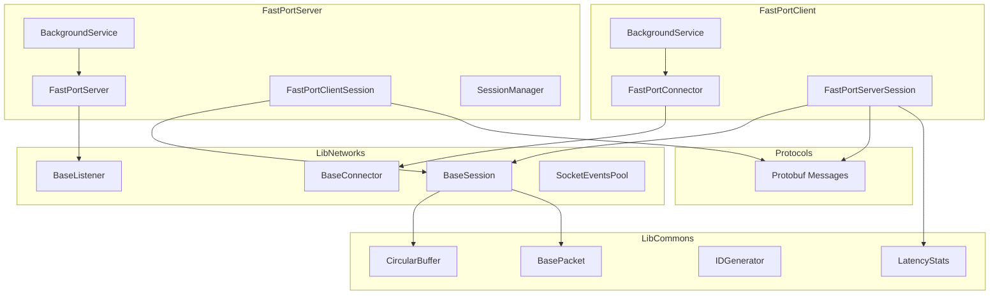
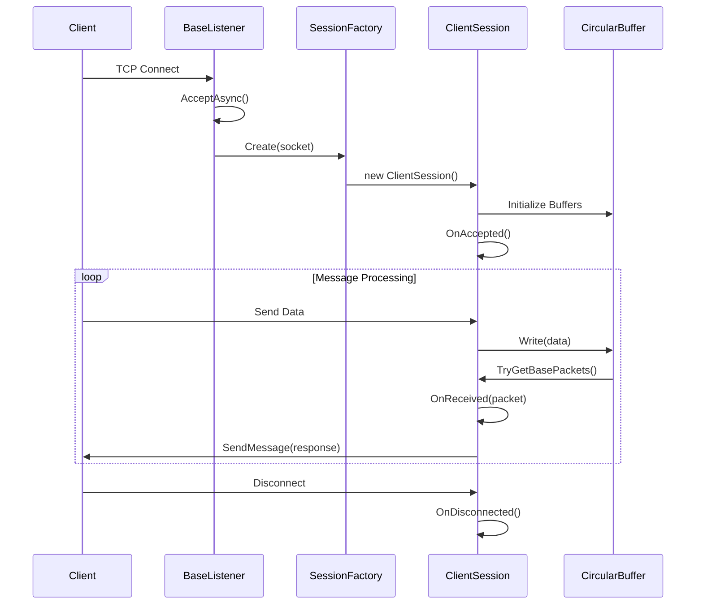

# 🚀 FastPortSharp

**고성능 비동기 TCP 소켓 서버/클라이언트 프레임워크**

.NET 10 기반의 확장 가능한 네트워크 라이브러리로, 게임 서버, 실시간 통신 시스템 등 대규모 동시 접속을 처리해야 하는 애플리케이션을 위해 설계되었습니다.

---

## 📋 목차

- [프로젝트 개요](#-프로젝트-개요)
- [주요 기능](#-주요-기능)
- [기술 스택](#-기술-스택)
- [성능 벤치마크](#-성능-벤치마크)
- [리포트](#-리포트)
- [아키텍처](#-아키텍처)
- [프로젝트 구조](#-프로젝트-구조)
- [핵심 구현](#-핵심-구현)
- [시작하기](#-시작하기)
- [라이선스](#-라이선스)

---

## 🎯 프로젝트 개요

FastPortSharp는 고성능 네트워크 통신을 위한 프레임워크입니다. `SocketAsyncEventArgs` 기반의 비동기 I/O 패턴과 효율적인 버퍼 관리를 통해 최소한의 메모리 할당으로 높은 처리량을 달성합니다.

### 개발 동기

- 대규모 동시 접속 환경에서의 안정적인 네트워크 처리
- 재사용 가능한 모듈화된 네트워크 컴포넌트 설계
- Protocol Buffers를 활용한 효율적인 직렬화/역직렬화

---

## ✨ 주요 기능

| 기능 | 설명 |
|------|------|
| **비동기 I/O** | `SocketAsyncEventArgs` 기반 IOCP 패턴으로 높은 동시성 처리 |
| **순환 버퍼** | 메모리 재사용을 통한 GC 압박 최소화 |
| **Protocol Buffers** | Google Protobuf 기반의 효율적인 메시지 직렬화 |
| **세션 관리** | Factory 패턴 기반의 유연한 세션 생성 및 관리 |
| **Keep-Alive** | TCP Keep-Alive 설정을 통한 연결 상태 모니터링 |
| **BackgroundService** | .NET Generic Host 기반의 서비스 생명주기 관리 |
| **Latency 통계** | 실시간 RTT, 서버 처리 시간, 네트워크 지연 측정 |

---

## 🛠 기술 스택

| 영역 | 기술 |
|------|------|
| Language | C# 14 / .NET 10 |
| Async Pattern | SocketAsyncEventArgs (IOCP) |
| Serialization | Google Protocol Buffers |
| DI Container | Microsoft.Extensions.DependencyInjection |
| Hosting | Microsoft.Extensions.Hosting |
| Concurrency | TPL Dataflow, ReaderWriterLockSlim |
| Testing | MSTest, BenchmarkDotNet |

---

## 📊 성능 벤치마크

> **측정 환경**: Windows 11, Intel Core i5-14600K 3.50GHz, .NET 10

### 핵심 성능 지표

| 항목 | 결과 | 비고 |
|------|------|------|
| **CircularBuffer Write** | 244~670 ns | 64B~8KB 데이터 |
| **CircularBuffer vs QueueBuffer** | **20배 빠름** | 4KB 데이터 기준 |
| **Channel vs BufferBlock** | **4배 빠름** | 메모리 66% 절약 |
| **.NET 9 Lock vs lock** | **7% 빠름** | 단일 스레드 기준 |

### 📈 상세 벤치마크 결과

👉 **[전체 벤치마크 결과 보기](docs/baseline-benchmark-results.md)**

### 벤치마크 실행

```bash
dotnet run -c Release --project FastPortBenchmark
```

---

## 📑 리포트

### 성능 테스트 리포트

| 리포트 | 설명 | 링크 |
|--------|------|------|
| **개선 전 퍼포먼스 리포트** | Latency 성능 테스트 결과 (RTT, 서버 처리 시간, 네트워크 지연) | [📄 보기](docs/latency-performance-report.md) |
| **벤치마크 결과** | BenchmarkDotNet 기반 컴포넌트별 성능 측정 | [📄 보기](docs/baseline-benchmark-results.md) |

---

## 🏗 아키텍처

### 전체 시스템 구조



### 서버 연결 흐름



---

## 📁 프로젝트 구조

```
FastPortSharp/
├── 📂 LibCommons/                 # 공통 유틸리티 라이브러리
│   ├── BaseCircularBuffers.cs     # 순환 버퍼 구현
│   ├── ArrayPoolCircularBuffers.cs # ArrayPool 기반 순환 버퍼
│   ├── BasePacket.cs              # 패킷 구조체
│   ├── LatencyStats.cs            # Latency 통계 수집
│   └── IBuffers.cs                # 버퍼 인터페이스
│
├── 📂 LibNetworks/                # 네트워크 코어 라이브러리
│   ├── BaseListener.cs            # TCP 리스너 베이스
│   ├── BaseConnector.cs           # TCP 커넥터 베이스
│   ├── SocketEventsPool.cs        # SocketAsyncEventArgs 풀
│   └── 📂 Sessions/
│       ├── BaseSession.cs         # 세션 핵심 로직
│       └── IClientSessionFactory.cs
│
├── 📂 FastPortServer/             # TCP 서버 애플리케이션
├── 📂 FastPortClient/             # TCP 클라이언트 애플리케이션
├── 📂 Protocols/                  # Protocol Buffers 정의
├── 📂 FastPortBenchmark/          # 성능 벤치마크
├── 📂 LibCommonTest/              # 단위 테스트
└── 📂 docs/                       # 문서
    ├── latency-performance-report.md    # Latency 성능 리포트
    ├── baseline-benchmark-results.md    # 벤치마크 결과
    └── FastPortSharp-Optimization-Guide-Confluence.md
```

---

## 🔧 핵심 구현

### 1. 순환 버퍼 (Circular Buffer)

메모리 재할당 없이 연속적인 데이터 스트림을 효율적으로 처리합니다.

```csharp
public class BaseCircularBuffers : IBuffers, IDisposable
{
    private byte[] m_Buffers;
    private int m_Head = 0;  // 읽기 위치
    private int m_Tail = 0;  // 쓰기 위치
    
    public int Write(byte[] buffers, int offset, int count)
    {
        // 용량 부족 시 자동 확장
        // 순환 쓰기 로직으로 메모리 효율화
    }
}
```

### 2. Factory 패턴 기반 세션 생성

```csharp
public interface IClientSessionFactory
{
    BaseSessionClient Create(Socket socket);
}

public class FastPortClientSessionFactory : IClientSessionFactory
{
    public BaseSessionClient Create(Socket socket)
    {
        return new FastPortClientSession(_logger, socket, 
            new ArrayPoolCircularBuffers(8192), 
            new ArrayPoolCircularBuffers(8192));
    }
}
```

### 3. Protocol Buffers 메시지 처리

```csharp
protected void RequestSendMessage<T>(int packetId, IMessage<T> message) 
    where T : IMessage<T>
{
    Span<byte> packetIdBuffers = BitConverter.GetBytes(packetId);
    ReadOnlySpan<byte> messageBuffers = message.ToByteArray();
    
    byte[] packetBuffers = new byte[packetIdBuffers.Length + messageBuffers.Length];
    packetIdBuffers.CopyTo(packetBuffers);
    messageBuffers.CopyTo(packetBuffers.AsSpan(packetIdBuffers.Length));
    
    RequestSendBuffers(packetBuffers);
}
```

### 4. Latency 통계 수집

```csharp
// appsettings.json 설정
{
  "LatencyStats": {
    "EnableConsoleOutput": true,
    "EnableFileOutput": true,
    "OutputDirectory": "Stats",
    "OutputFilePrefix": "latency_stats"
  }
}
```

---

## 🚀 시작하기

### 필수 조건

- .NET 10 SDK
- Visual Studio 2022 또는 VS Code

### 빌드 및 실행

```bash
# 솔루션 빌드
dotnet build FastPortSharp.sln

# 서버 실행
dotnet run --project FastPortServer

# 클라이언트 실행 (새 터미널)
dotnet run --project FastPortClient
```

### 테스트 실행

```bash
dotnet test LibCommonTest
```

---

## 📈 성능 최적화 로드맵

| 순위 | 항목 | 예상 개선 | 상태 |
|:----:|------|----------|:----:|
| 1 | ArrayPool 적용 | 메모리 90%↓ | ☑  |
| 2 | Channel\<T\> 전환 | 속도 4배↑ | 🔲 |
| 3 | .NET 10 Lock 적용 | 속도 9%↑ | ☑  |
| 4 | BasePacket struct 변환 | 할당 감소 | 🔲 |

👉 **[최적화 가이드 상세](docs/FastPortSharp-Optimization-Guide-Confluence.md)**

---

## 📝 라이선스

이 프로젝트는 MIT 라이선스 하에 배포됩니다.

---

## 👤 개발자

**boinred**

[](https://github.com/boinred)

---

> 💡 이 프로젝트는 지속적으로 개선되고 있습니다. 피드백과 기여를 환영합니다!

