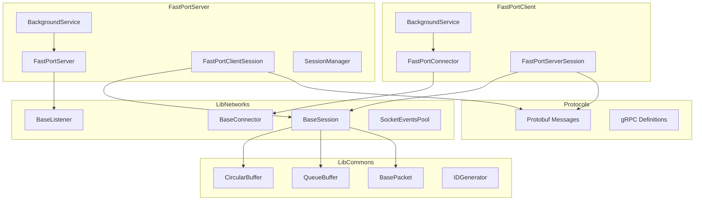
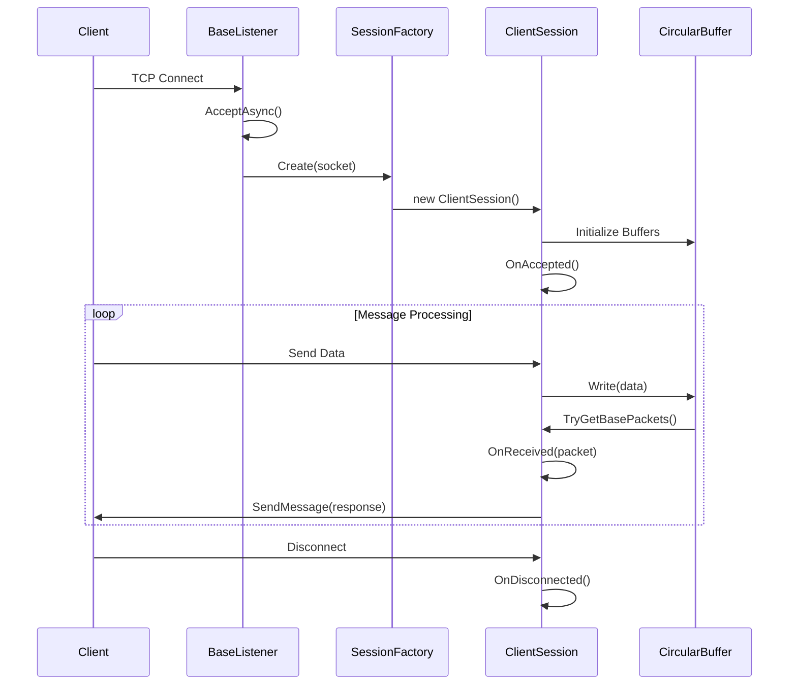
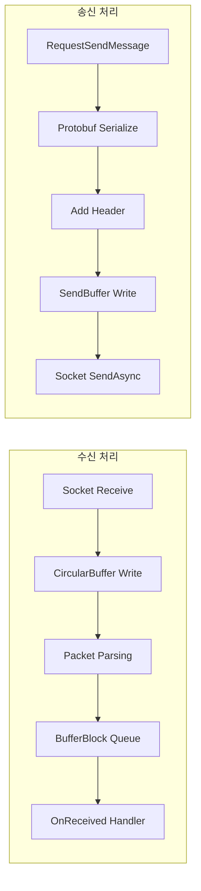

# 🚀 FastPortSharp

**고성능 비동기 TCP 소켓 서버/클라이언트 프레임워크**

.NET 9 기반의 확장 가능한 네트워크 라이브러리로, 게임 서버, 실시간 통신 시스템 등 대규모 동시 접속을 처리해야 하는 애플리케이션을 위해 설계되었습니다.

---

## 📋 목차

- [프로젝트 개요](#-프로젝트-개요)
- [주요 기능](#-주요-기능)
- [기술 스택](#-기술-스택)
- [아키텍처](#-아키텍처)
- [프로젝트 구조](#-프로젝트-구조)
- [핵심 구현](#-핵심-구현)
- [시작하기](#-시작하기)
- [라이선스](#-라이선스)

---

## 🎯 프로젝트 개요

FastPortSharp는 고성능 네트워크 통신을 위한 프레임워크입니다. `SocketAsyncEventArgs` 기반의 비동기 I/O 패턴과 효율적인 버퍼 관리를 통해 최소한의 메모리 할당으로 높은 처리량을 달성합니다.

### 개발 동기

- 대규모 동시 접속 환경에서의 안정적인 네트워크 처리
- 재사용 가능한 모듈화된 네트워크 컴포넌트 설계
- Protocol Buffers를 활용한 효율적인 직렬화/역직렬화

---

## ✨ 주요 기능

| 기능 | 설명 |
|------|------|
| **비동기 I/O** | `SocketAsyncEventArgs` 기반 IOCP 패턴으로 높은 동시성 처리 |
| **순환 버퍼** | 메모리 재사용을 통한 GC 압박 최소화 |
| **Protocol Buffers** | Google Protobuf 기반의 효율적인 메시지 직렬화 |
| **세션 관리** | Factory 패턴 기반의 유연한 세션 생성 및 관리 |
| **Keep-Alive** | TCP Keep-Alive 설정을 통한 연결 상태 모니터링 |
| **BackgroundService** | .NET Generic Host 기반의 서비스 생명주기 관리 |

---

## 🛠 기술 스택

```
┌─────────────────────────────────────────────────────────────┐
│                      FastPortSharp                          │
├─────────────────────────────────────────────────────────────┤
│  Language        │  C# 13 / .NET 9                          │
│  Async Pattern   │  SocketAsyncEventArgs (IOCP)             │
│  Serialization   │  Google Protocol Buffers (gRPC)          │
│  DI Container    │  Microsoft.Extensions.DependencyInjection│
│  Hosting         │  Microsoft.Extensions.Hosting            │
│  Concurrency     │  TPL Dataflow, ReaderWriterLockSlim      │
│  Testing         │  xUnit (LibCommonTest)                   │
└─────────────────────────────────────────────────────────────┘
```

---

## 🏗 아키텍처

### 전체 시스템 구조



### 서버 연결 흐름



### 패킷 처리 파이프라인



---

## 📁 프로젝트 구조

```
FastPortSharp/
├── 📂 LibCommons/                 # 공통 유틸리티 라이브러리
│   ├── BaseCircularBuffers.cs     # 순환 버퍼 구현
│   ├── BaseQueueBuffers.cs        # 큐 기반 버퍼 구현
│   ├── BasePacket.cs              # 패킷 구조체
│   ├── IBuffers.cs                # 버퍼 인터페이스
│   └── IDGenerator.cs             # 고유 ID 생성기
│
├── 📂 LibNetworks/                # 네트워크 코어 라이브러리
│   ├── BaseSocket.cs              # 소켓 기본 클래스
│   ├── BaseListener.cs            # TCP 리스너 베이스
│   ├── BaseConnector.cs           # TCP 커넥터 베이스
│   ├── BaseMessageListener.cs     # 메시지 기반 리스너
│   ├── BaseMessageConnector.cs    # 메시지 기반 커넥터
│   ├── SocketEventsPool.cs        # SocketAsyncEventArgs 풀
│   ├── AddressConverter.cs        # IP 주소 변환 유틸
│   ├── 📂 Sessions/
│   │   ├── BaseSession.cs         # 세션 핵심 로직
│   │   ├── BaseSessionClient.cs   # 클라이언트 세션
│   │   ├── BaseSessionServer.cs   # 서버 세션
│   │   ├── IClientSessionFactory.cs
│   │   └── IServerSessionFactory.cs
│   └── 📂 Extensions/
│       └── Socket+Extensions.cs   # 소켓 확장 메서드
│
├── 📂 FastPortServer/             # TCP 서버 애플리케이션
│   ├── FastPortServer.cs          # 서버 메인 클래스
│   ├── FastPortServerBackgroundService.cs
│   ├── Program.cs
│   └── 📂 Sessions/
│       ├── FastPortClientSession.cs
│       ├── FastPortClientSessionFactory.cs
│       └── FastPortClientSessionManager.cs
│
├── 📂 FastPortClient/             # TCP 클라이언트 애플리케이션
│   ├── FastPortConnector.cs       # 클라이언트 커넥터
│   ├── FastPortClientBackgroundService.cs
│   ├── Program.cs
│   └── 📂 Sessions/
│       ├── FastPortServerSession.cs
│       └── FastPortServerSessionFactory.cs
│
├── 📂 Protocols/                  # Protocol Buffers 정의
│   ├── TestMessage.cs
│   └── *.proto files
│
└── 📂 LibCommonTest/              # 단위 테스트
    └── BufferTests.cs
```

---

## 🔧 핵심 구현

### 1. 순환 버퍼 (Circular Buffer)

메모리 재할당 없이 연속적인 데이터 스트림을 효율적으로 처리합니다.

```csharp
public class BaseCircularBuffers : IBuffers, IDisposable
{
    private byte[] m_Buffers;
    private int m_Head = 0;  // 읽기 위치
    private int m_Tail = 0;  // 쓰기 위치
    
    public int Write(byte[] buffers, int offset, int count)
    {
        // 용량 부족 시 자동 확장
        // 순환 쓰기 로직으로 메모리 효율화
    }
    
    public bool TryGetBasePackets(out List<BasePacket> basePackets)
    {
        // 패킷 단위로 데이터 추출
    }
}
```

### 2. 비동기 세션 관리

TPL Dataflow를 활용한 생산자-소비자 패턴으로 패킷을 처리합니다.

```csharp
public abstract class BaseSession
{
    private readonly BufferBlock<BasePacket> m_ReceivedPackets;
    
    // 수신 버퍼 처리 태스크
    private async Task DoWorkReceivedBuffers(CancellationToken ct)
    {
        while (!ct.IsCancellationRequested)
        {
            if (m_ReceivedBuffers.TryGetBasePackets(out var packets))
            {
                foreach (var packet in packets)
                    await m_ReceivedPackets.SendAsync(packet);
            }
        }
    }
}
```

### 3. Factory 패턴 기반 세션 생성

의존성 주입과 Factory 패턴을 결합하여 유연한 세션 관리를 구현합니다.

```csharp
public interface IClientSessionFactory
{
    BaseSessionClient Create(Socket socket);
}

public class FastPortClientSessionFactory : IClientSessionFactory
{
    public BaseSessionClient Create(Socket socket)
    {
        return new FastPortClientSession(_logger, socket, 
            new BaseCircularBuffers(8192), 
            new BaseCircularBuffers(8192));
    }
}
```

### 4. Protocol Buffers 메시지 처리

```csharp
protected void RequestSendMessage<T>(int packetId, IMessage<T> message) 
    where T : IMessage<T>
{
    Span<byte> packetIdBuffers = BitConverter.GetBytes(packetId);
    ReadOnlySpan<byte> messageBuffers = message.ToByteArray();
    
    byte[] packetBuffers = new byte[packetIdBuffers.Length + messageBuffers.Length];
    packetIdBuffers.CopyTo(packetBuffers);
    messageBuffers.CopyTo(packetBuffers.AsSpan(packetIdBuffers.Length));
    
    RequestSendBuffers(packetBuffers);
}

