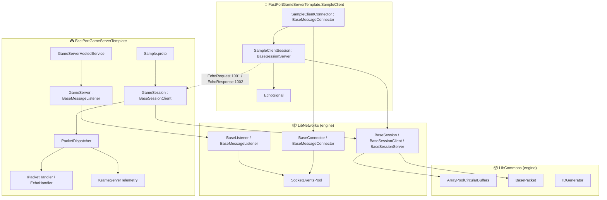
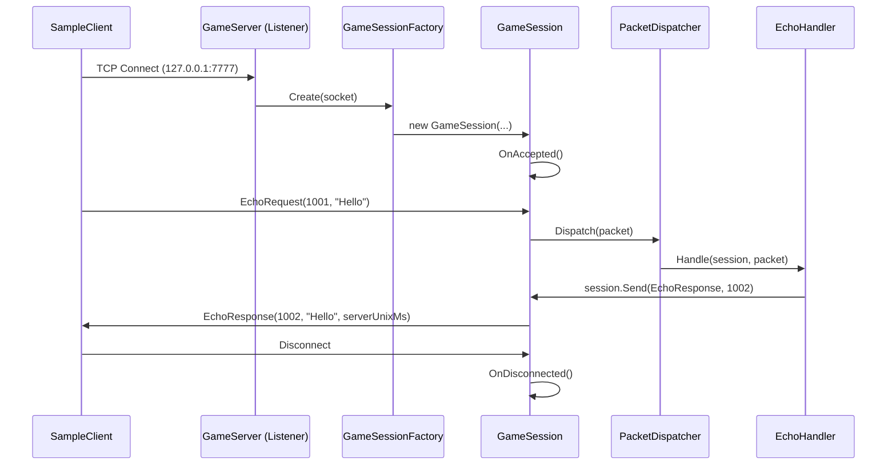

# 🚀 FastPortSharp

**High-Performance .NET 10 TCP Engine + Game Server Starter Template**

English | [한국어](README.ko.md)

FastPortSharp pairs a validated `SocketAsyncEventArgs`-based TCP engine
(10K concurrent sessions tested) with a ready-to-bootstrap game server
template. Use this repository as a GitHub Template Repository to spin up a
new C# / .NET 10 game server in minutes — focus on game logic, not on
sockets, buffers, or framing.

---

## 📋 Table of Contents

- [Project Overview](#-project-overview)
- [Game Server Template](#-game-server-template)
- [Key Features](#-key-features)
- [Tech Stack](#-tech-stack)
- [Performance Benchmarks](#-performance-benchmarks)
- [Reports](#-reports)
- [Architecture](#-architecture)
- [Project Structure](#-project-structure)
- [Core Implementation](#-core-implementation)
- [Getting Started](#-getting-started)
- [License](#-license)

---

## 🎯 Project Overview

FastPortSharp is a two-layer offering:

- **Engine** (`LibCommons` + `LibNetworks`) — protocol-neutral TCP listener /
  session / connector primitives validated under 10K concurrent sessions.
  Built on `SocketAsyncEventArgs` IOCP, `Channel<T>`, ArrayPool-backed
  circular buffers, and the .NET 10 lightweight `Lock`.
- **Game Server Template** (`FastPortGameServerTemplate` +
  `FastPortGameServerTemplate.SampleClient`) — a Generic Host based starter
  with Serilog, Protobuf, and a session / handler / dispatcher trio that
  consumes the engine. Drop in your `.proto` files and handlers and you have
  a game server.

### Motivation

- Reliable network processing in large-scale concurrent connection environments.
- Modular, reusable engine components that can be embedded in any .NET host.
- A "0 → 1 game server in minutes" path that stays opinionated only where it
  matters (host wiring, framing, telemetry hook) and out of the way everywhere else.

---

## 🎮 Game Server Template

`FastPortGameServerTemplate/` is the starter project for building a new game
server on top of the validated TCP engine (`LibCommons` + `LibNetworks`). It
ships pre-wired with Generic Host, Serilog, Protobuf, and a session / handler /
dispatcher trio so you can focus on game logic instead of plumbing.

### What you get out of the box

| Concern | Implementation |
|---|---|
| Hosting | `Microsoft.Extensions.Hosting` (`Host.CreateApplicationBuilder`) |
| Logging | Serilog Console sink, configured from `appsettings.json` |
| Listener | `GameServer : LibNetworks.BaseMessageListener` |
| Per-session | `GameSession : LibNetworks.Sessions.BaseSessionClient` |
| Dispatch | `PacketDispatcher` routes packet id → `IPacketHandler` |
| Sample protocol | `Sample.proto` (Grpc.Tools, `GrpcServices=None`) — `EchoRequest` (1001) / `EchoResponse` (1002) |
| Telemetry hook | `IGameServerTelemetry` + `NullGameServerTelemetry` (replace via DI) |
| Sample client | `FastPortGameServerTemplate.SampleClient/` for verifying full echo round-trip |
| Config | `appsettings.json` → `GameServerOptions` (listen address / port / max sessions) |

The template references **only** `LibCommons` + `LibNetworks` — never
`FastPortServer`, `FastPortClient`, `Protocols/`, or any test project. This
keeps the engine boundary clean and your game-server code free of test scaffolding.

### Quickstart

```bash
# 1. Build the whole solution
dotnet build FastPortSharp.sln -c Release

# 2. Start the template server (terminal 1)
dotnet run --project FastPortGameServerTemplate -c Release
# → "GameServer listening" on 0.0.0.0:7777

# 3. Verify a full Protobuf echo round-trip (terminal 2)
dotnet run --project FastPortGameServerTemplate.SampleClient -c Release
# → "EchoResponse received. Message=\"Hello, FastPort!\", RTT=...ms"
```

Listen address / port / max sessions are configured in
`FastPortGameServerTemplate/appsettings.json`.

### Customising the server

1. **Add a new packet** — drop a `.proto` into `FastPortGameServerTemplate/Protocols/`.
   Grpc.Tools regenerates C# classes on `dotnet build`. Add the new packet id
   to `Handlers/PacketIds.cs` (use `≥ 2000` for user-defined ids).

2. **Implement a handler**:

   ```csharp
   public sealed class MyHandler : IPacketHandler
   {
       public int PacketId => PacketIds.MyRequest;
       public void Handle(GameSession session, BasePacket packet) { /* ... */ }
   }
   ```

3. **Register it** in `Program.cs`:

   ```csharp
   builder.Services.AddSingleton<IPacketHandler, MyHandler>();
   ```

4. **Replace the telemetry hook** with your own `IGameServerTelemetry`
   implementation (e.g. backed by OpenTelemetry) by overriding the DI
   registration in `Program.cs`.

5. **Tune buffer sizes** in `Sessions/GameSessionFactory.cs`
   (`BufferCapacityBytes`, default `8 KiB` — same as the validated 10K-session
   benchmark configuration).

### Distribution

This repository is the GitHub Template Repository for the game server
template. Click **"Use this template"** on GitHub, or `git clone`/`fork`,
then prune the projects you don't need. **Uploading the engine to nuget.org
is intentionally out of scope** — consumers either clone the repo or reuse
the engine via `ProjectReference` within the same solution.

#### Scaffold a fresh project (one command)

If you'd rather start from a clean self-contained checkout (just your
server + the engine, with the template token renamed to your project
name), use the cross-platform scaffold script:

```bash
# Linux / macOS
scripts/scaffold-game-server.sh   MyLobbyServer ../my-lobby

# Windows / cross-platform
pwsh -File scripts/scaffold-game-server.ps1 MyLobbyServer ../my-lobby
```

This copies `FastPortGameServerTemplate/` + `LibCommons/` + `LibNetworks/`
to the destination, renames everything from `FastPortGameServerTemplate`
to your chosen name, generates `<name>.sln`, runs `git init`, and
smoke-tests with `dotnet build`. See `scripts/README.md` for options
(`--force`, `--no-git`, `--dry-run`, `--skip-smoke`) and exit codes.

For the full step-by-step walkthrough and Korean version, see
`FastPortGameServerTemplate/README.md` and
`FastPortGameServerTemplate/QUICKSTART.ko.md`.

---

## ✨ Key Features

| Feature | Description |
|------|------|
| **Async I/O** | High concurrency processing with `SocketAsyncEventArgs`-based IOCP pattern |
| **Circular Buffer** | ArrayPool-backed circular buffer minimises GC pressure under sustained throughput |
| **Channel\<T\>** | Bounded `Channel<T>` for receive/send pipelines — 4× faster, 69% less memory than `BufferBlock<T>` |
| **Protocol Buffers** | Efficient message serialization based on Google Protobuf, generated via Grpc.Tools |
| **Session Management** | Flexible session creation and management based on the Factory pattern |
| **Keep-Alive** | Connection state monitoring via TCP Keep-Alive settings |
| **Generic Host** | `Microsoft.Extensions.Hosting` lifecycle for both server and client |
| **Game Server Template** | Drop-in starter with Serilog, Protobuf, session / handler / dispatcher pre-wired |
| **Latency Statistics** | Real-time RTT, server processing time, and network delay measurement (load runner) |

---

## 🛠 Tech Stack

| Domain | Technology |
|------|------|
| Language | C# 14 / .NET 10 |
| Async Pattern | SocketAsyncEventArgs (IOCP) |
| Concurrency | **Channel\<T\>**, .NET 10 `Lock` |
| Serialization | Google Protocol Buffers + Grpc.Tools (gen, no gRPC runtime) |
| DI Container | Microsoft.Extensions.DependencyInjection |
| Hosting | Microsoft.Extensions.Hosting (Generic Host) |
| Logging | Serilog (template) / Microsoft.Extensions.Logging |
| Testing | MSTest, FastPortTestLoadRunner, FastPortTestLoadValidation |

---

## 📊 Performance Benchmarks

> **Environment**: Windows 11, Intel Core i5-14600K 3.50GHz, .NET 10

### Key Performance Indicators

| Item | Result | Note |
|------|------|------|
| **CircularBuffer Write** | 244~670 ns | 64B~8KB data |
| **CircularBuffer vs QueueBuffer** | **20× faster** | Based on 4KB data |
| **Channel vs BufferBlock** | **4× faster** | 69% memory savings |
| **.NET 10 Lock vs lock** | **9% faster** | Based on 10,000 iterations |

### 📈 Detailed Benchmark Results

👉 **[View Full Benchmark Results](docs/baseline-benchmark-results.md)**

👉 **[View 10K Load Validation Results](docs/load-validation-benchmark-results.md)**

### Running Load Tests

```bash
dotnet run -c Release --project tests-projects/FastPortTestLoadRunner -- --sessions 10000 --payload random:4096-16384 --duration 5m --ramp-up 60s
```

---

## 📑 Reports

### Performance Test Reports

| Report | Description | Link |
|--------|-------------|------|
| **Pre-optimization Performance Report** | Latency performance test results before optimization | [📄 View](docs/latency-performance-report.md) |
| **Lock-optimized Performance Report** | Performance test after applying ArrayPool + .NET 10 Lock | [📄 View](docs/latency-performance-report-after-lock.md) |
| **Channel-optimized Performance Report** | Performance test after applying full optimizations | [📄 View](docs/latency-performance-report-after-channel.md) |
| **Historical Benchmark Results** | Component-specific micro benchmark results captured before the load runner migration | [📄 View](docs/baseline-benchmark-results.md) |
| **10K Load Validation Results** | Same-machine 10K load validation comparison for server send backpressure optimization | [📄 View](docs/load-validation-benchmark-results.md) |

### Optimization Summary

| Metric | Before | Final (Channel applied) | Improvement |
|------|--------|---------------------|--------|
| Average RTT | 96.03 ms | 55.68 ms | **42.0%↓** |
| Server Processing Time | 0.234 ms | 0.002 ms | **99.1%↓** |
| Max RTT | 434.40 ms | 83.13 ms | **80.9%↓** |
| Throughput | ~489/min | ~1,080/min | **2.2×↑** |

---

## 🏗 Architecture

### System Structure


```mermaid
flowchart TB
    subgraph Template ["🎮 FastPortGameServerTemplate"]
        GS[GameServer : BaseMessageListener]
        GHS[GameServerHostedService]
        GSE[GameSession : BaseSessionClient]
        PD[PacketDispatcher]
        PH[IPacketHandler / EchoHandler]
        TGT[IGameServerTelemetry]
        SP[Sample.proto]
    end

    subgraph SampleClient ["🧪 FastPortGameServerTemplate.SampleClient"]
        SC[SampleClientConnector : BaseMessageConnector]
        SCS[SampleClientSession : BaseSessionServer]
        ES[EchoSignal]
    end

    subgraph LibNetworks ["📦 LibNetworks (engine)"]
        BL[BaseListener / BaseMessageListener]
        BC[BaseConnector / BaseMessageConnector]
        BS[BaseSession / BaseSessionClient / BaseSessionServer]
        SEP[SocketEventsPool]
    end

    subgraph LibCommons ["📦 LibCommons (engine)"]
        CB[ArrayPoolCircularBuffers]
        BP[BasePacket]
        IDG[IDGenerator]
    end

    GS --> BL
    GHS --> GS
    GSE --> BS
    GSE --> PD
    PD --> PH
    PD --> TGT
    SP --> GSE

    SC --> BC
    SCS --> BS
    SC --> SCS
    SCS --> ES

    BS --> CB
    BS --> BP
    BL --> SEP
    BC --> SEP

    SCS -. EchoRequest 1001 / EchoResponse 1002 .-> GSE
```

### Server Connection Flow (template)


```mermaid
sequenceDiagram
    participant C as SampleClient
    participant L as GameServer (Listener)
    participant SF as GameSessionFactory
    participant S as GameSession
    participant D as PacketDispatcher
    participant H as EchoHandler

    C->>L: TCP Connect (127.0.0.1:7777)
    L->>SF: Create(socket)
    SF->>S: new GameSession(...)
    S->>S: OnAccepted()
    C->>S: EchoRequest(1001, "Hello")
    S->>D: Dispatch(packet)
    D->>H: Handle(session, packet)
    H->>S: session.Send(EchoResponse, 1002)
    S->>C: EchoResponse(1002, "Hello", serverUnixMs)
    C->>S: Disconnect
    S->>S: OnDisconnected()
```

> Engine validation projects (`FastPortServer`, `FastPortClient`,
> `FastPortTestSmokeServer`, `FastPortTestLoadRunner`,
> `FastPortTestLoadValidation`, `FastPortTests`) consume the same engine
> primitives but live separately from the template — see Project Structure
> below.

---

## 📁 Project Structure

```
FastPortSharp/
├── 📂 LibCommons/                            # Engine: buffers, packet, IDs
│   ├── BaseCircularBuffers.cs                 # Circular buffer (.NET 10 Lock)
│   ├── ArrayPoolCircularBuffers.cs            # ArrayPool-backed circular buffer
│   ├── BasePacket.cs                          # Packet structure
│   ├── IBuffers.cs                            # Buffer interface
│   ├── IDGenerator.cs                         # Session/request id generator
│   └── LatencyStats.cs                        # Latency stats (used by load runner)
│
├── 📂 LibNetworks/                           # Engine: TCP listener / session / connector
│   ├── BaseListener.cs / BaseMessageListener.cs
│   ├── BaseConnector.cs / BaseMessageConnector.cs
│   ├── SocketEventsPool.cs
│   ├── Extensions/BasePacket+Extensions.cs    # ParseMessageFromPacket<T>
│   └── 📂 Sessions/
│       ├── BaseSession.cs                      # Channel<T> + ArrayPool framing
│       ├── BaseSessionClient.cs                # Server-side accepted session
│       ├── BaseSessionServer.cs                # Client-side outgoing session
│       └── IClientSessionFactory.cs
│
├── 🎮 FastPortGameServerTemplate/            # Game server starter (template)
│   ├── Application/
│   │   ├── GameServer.cs                       # : BaseMessageListener
│   │   ├── GameServerHostedService.cs          # IHostedService lifecycle
│   │   └── PacketDispatcher.cs
│   ├── Sessions/
│   │   ├── GameSession.cs                      # : BaseSessionClient
│   │   └── GameSessionFactory.cs
│   ├── Handlers/
│   │   ├── IPacketHandler.cs
│   │   ├── EchoHandler.cs                      # 1001 → 1002 round-trip sample
│   │   └── PacketIds.cs
│   ├── Telemetry/
│   │   ├── IGameServerTelemetry.cs
│   │   └── NullGameServerTelemetry.cs
│   ├── Configuration/GameServerOptions.cs
│   ├── Protocols/Sample.proto                  # Grpc.Tools, GrpcServices=None
│   ├── Program.cs                              # Generic Host + Serilog wiring
│   ├── appsettings.json
│   ├── README.md / QUICKSTART.ko.md
│   └── FastPortGameServerTemplate.csproj
│
├── 🧪 FastPortGameServerTemplate.SampleClient/  # Verifies full echo round-trip
│   ├── Sessions/
│   │   ├── SampleClientSession.cs              # : BaseSessionServer
│   │   └── SampleClientSessionFactory.cs
│   ├── SampleClientConnector.cs                # : BaseMessageConnector
│   ├── SampleClientHostedService.cs            # Connects, sends 1001, awaits 1002
│   ├── SampleClientOptions.cs / EchoSignal.cs
│   ├── Program.cs / appsettings.json
│   └── FastPortGameServerTemplate.SampleClient.csproj
│
├── 📂 FastPortServer/                        # Engine sample/host (validation)
├── 📂 FastPortClient/                        # Engine sample/client (with LatencyStats)
├── 📂 Protocols/                             # Engine-internal sample protocol
├── 📂 tests-projects/                        # Grouped test surface
│   ├── FastPortTestSmokeServer/              # Smoke/echo test server
│   ├── FastPortTestLoadRunner/               # 10K-session load runner
│   ├── FastPortTestLoadValidation/           # Load validation harness
│   ├── FastPortTests/                        # MSTest unit tests (139 cases)
│   └── LibTestTelemetry/                     # Test-only telemetry contracts (JSONL)
│
├── 📂 docs/                                  # Performance reports, PDCA archive
└── FastPortSharp.sln
```

---

## 🔧 Core Implementation

### 1. Circular Buffer

Efficiently handles continuous data streams without memory reallocation.

```csharp
public class BaseCircularBuffers : IBuffers, IDisposable
{
    private byte[] m_Buffers;
    private int m_Head = 0;  // Read position
    private int m_Tail = 0;  // Write position

    // Uses .NET 10 lightweight Lock
    private readonly Lock m_Lock = new();

    public int Write(byte[] buffers, int offset, int count)
    {
        lock (m_Lock)
        {
            // Auto-expansion when capacity is low
            // Circular write logic for memory efficiency
        }
    }
}
```

### 2. Channel\<T\> Based Packet Processing

Uses `Channel<T>` for high-performance asynchronous message delivery.

```csharp
// 4× faster and 69% memory savings compared to BufferBlock<T>
private readonly Channel<BasePacket> m_ReceivedPackets =
    Channel.CreateBounded<BasePacket>(new BoundedChannelOptions(1000)
    {
        FullMode = BoundedChannelFullMode.Wait,
        SingleReader = true,
        SingleWriter = true
    });

await foreach (var packet in m_ReceivedPackets.Reader.ReadAllAsync(cancellationToken))
{
    OnReceived(packet);
}
```

### 3. Factory Pattern Based Session Creation

```csharp
public interface IClientSessionFactory
{
    BaseSessionClient Create(Socket socket);
}

// Template's GameSessionFactory wires session + dispatcher + telemetry.
public sealed class GameSessionFactory : IClientSessionFactory
{
    public BaseSessionClient Create(Socket clientSocket) => new GameSession(
        m_Logger, clientSocket,
        new ArrayPoolCircularBuffers(8 * 1024),
        new ArrayPoolCircularBuffers(8 * 1024),
        m_Dispatcher, m_Telemetry);
}
```

### 4. Protobuf Round-Trip in the Template

```csharp
// Server (EchoHandler)
public void Handle(GameSession session, BasePacket packet)
{
    if (!packet.ParseMessageFromPacket<EchoRequest>(out _, out var request) || request is null) return;
    var response = new EchoResponse
    {
        Message = request.Message,
        ServerUnixMs = DateTimeOffset.UtcNow.ToUnixTimeMilliseconds(),
    };
    session.Send(PacketIds.EchoResponse, response);
}

// Client (SampleClientSession.OnConnected)
RequestSendMessage(PacketIds.EchoRequest, new EchoRequest { Message = "Hello, FastPort!" });
```

### 5. Wire Framing

```text
[ 2-byte length header ][ int32 LE packet id ][ protobuf payload ... ]
```

`LibNetworks.Sessions.BaseSession.RequestSendMessage<T>` and
`LibNetworks.Extensions.BasePacketExtensions.ParseMessageFromPacket<T>`
encode and decode this framing — handlers and the dispatcher only see
`BasePacket` and the strongly-typed Protobuf message.

---

## 🚀 Getting Started

### Prerequisites

- .NET 10 SDK
- Visual Studio 2022 / Rider / VS Code

### Path A — Build a new game server (recommended)

```bash
# Clone or "Use this template" on GitHub
git clone https://github.com/boinred/FastPortSharp.git
cd FastPortSharp

# Build
dotnet build FastPortSharp.sln -c Release

# Run the template server
dotnet run --project FastPortGameServerTemplate -c Release

# In another terminal, verify the full echo round-trip
dotnet run --project FastPortGameServerTemplate.SampleClient -c Release
```

Then customise `FastPortGameServerTemplate/` per the
[Customising the server](#customising-the-server) section above.

### Path B — Study the engine internals or run benchmarks

```bash
# Engine sample server / client (no game logic, raw echo on legacy protocol)
dotnet run --project FastPortServer -c Release
dotnet run --project FastPortClient -c Release

# 10K-session load runner
dotnet run -c Release --project tests-projects/FastPortTestLoadRunner -- \
  --sessions 10000 --payload random:4096-16384 --duration 5m --ramp-up 60s

# Smoke server with structured telemetry
dotnet run --project tests-projects/FastPortTestSmokeServer -c Release
```

### Run Tests

```bash
dotnet test FastPortSharp.sln -c Release --no-build
# 139 / 139 passed (as of 2026-05)
```

---

## 📝 License

This project is licensed under the MIT License.

---

## 👤 Developer

**boinred**

[](https://github.com/boinred)

---

> 💡 This project is continuously improving. Feedback and contributions are welcome!
