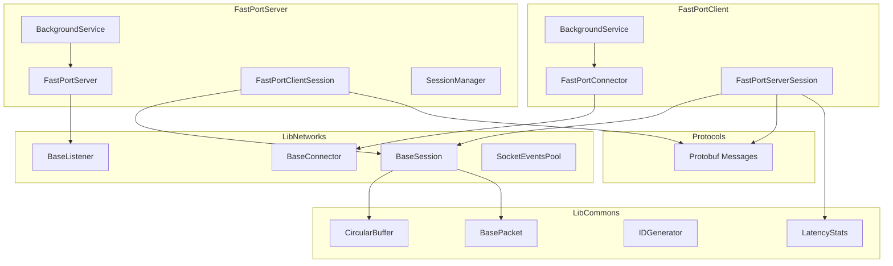
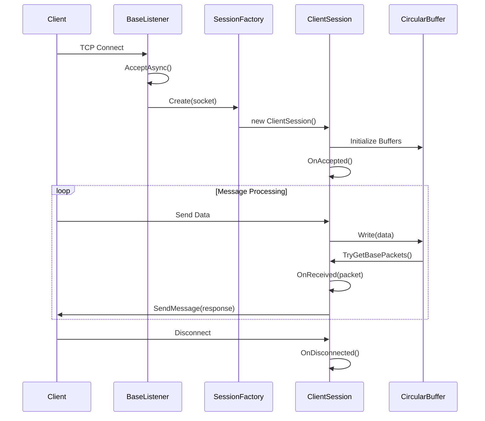

# 🚀 FastPortSharp

**High-Performance Asynchronous TCP Socket Server/Client Framework**

English | [한국어](README.ko.md)

A scalable network library based on .NET 10, designed for applications requiring large-scale concurrent connections, such as game servers and real-time communication systems.

---

## 📋 Table of Contents

- [Project Overview](#-project-overview)
- [Key Features](#-key-features)
- [Tech Stack](#-tech-stack)
- [Performance Benchmarks](#-performance-benchmarks)
- [Reports](#-reports)
- [Architecture](#-architecture)
- [Project Structure](#-project-structure)
- [Core Implementation](#-core-implementation)
- [Getting Started](#-getting-started)
- [License](#-license)

---

## 🎯 Project Overview

FastPortSharp is a framework for high-performance network communication. It achieves high throughput with minimal memory allocation using `SocketAsyncEventArgs`-based asynchronous I/O patterns and efficient buffer management.

### Motivation

- Reliable network processing in large-scale concurrent connection environments
- Modular and reusable network component design
- Efficient serialization/deserialization using Protocol Buffers

---

## ✨ Key Features

| Feature | Description |
|------|------|
| **Async I/O** | High concurrency processing with `SocketAsyncEventArgs`-based IOCP pattern |
| **Circular Buffer** | Minimized GC pressure through memory reuse |
| **Protocol Buffers** | Efficient message serialization based on Google Protobuf |
| **Session Management** | Flexible session creation and management based on the Factory pattern |
| **Keep-Alive** | Connection state monitoring via TCP Keep-Alive settings |
| **BackgroundService** | Service lifecycle management based on .NET Generic Host |
| **Latency Statistics** | Real-time measurement of RTT, server processing time, and network delay |

---

## 🛠 Tech Stack

| Domain | Technology |
|------|------|
| Language | C# 14 / .NET 10 |
| Async Pattern | SocketAsyncEventArgs (IOCP) |
| Serialization | Google Protocol Buffers |
| DI Container | Microsoft.Extensions.DependencyInjection |
| Hosting | Microsoft.Extensions.Hosting |
| Concurrency | **Channel\<T\>**, .NET 10 Lock |
| Testing | MSTest, FastPortLoadRunner |

---

## 📊 Performance Benchmarks

> **Environment**: Windows 11, Intel Core i5-14600K 3.50GHz, .NET 10

### Key Performance Indicators

| Item | Result | Note |
|------|------|------|
| **CircularBuffer Write** | 244~670 ns | 64B~8KB data |
| **CircularBuffer vs QueueBuffer** | **20x faster** | Based on 4KB data |
| **Channel vs BufferBlock** | **4x faster** | 69% memory savings |
| **.NET 10 Lock vs lock** | **9% faster** | Based on 10,000 iterations |

### 📈 Detailed Benchmark Results

👉 **[View Full Benchmark Results](docs/baseline-benchmark-results.md)**

### Running Load Tests

```bash
dotnet run -c Release --project FastPortLoadRunner -- --sessions 10000 --payload random:4096-16384 --duration 5m --ramp-up 60s
```

---

## 📑 Reports

### Performance Test Reports

| Report | Description | Link |
|--------|-------------|------|
| **Pre-optimization Performance Report** | Latency performance test results before optimization | [📄 View](docs/latency-performance-report.md) |
| **Lock-optimized Performance Report** | Performance test after applying ArrayPool + .NET 10 Lock | [📄 View](docs/latency-performance-report-after-lock.md) |
| **Channel-optimized Performance Report** | Performance test after applying full optimizations | [📄 View](docs/latency-performance-report-after-channel.md) |
| **Historical Benchmark Results** | Component-specific micro benchmark results captured before the load runner migration | [📄 View](docs/baseline-benchmark-results.md) |

### Optimization Summary

| Metric | Before | Final (Channel applied) | Improvement |
|------|--------|---------------------|--------|
| Average RTT | 96.03 ms | 55.68 ms | **42.0%↓** |
| Server Processing Time | 0.234 ms | 0.002 ms | **99.1%↓** |
| Max RTT | 434.40 ms | 83.13 ms | **80.9%↓** |
| Throughput | ~489/min | ~1,080/min | **2.2x↑** |

---

## 🏗 Architecture

### System Structure


```mermaid
flowchart TB
    subgraph Client ["FastPortClient"]
        CC[FastPortConnector]
        CSS[FastPortServerSession]
        CBS[BackgroundService]
    end
    
    subgraph Server ["FastPortServer"]
        FS[FastPortServer]
        FCS[FastPortClientSession]
        FSM[SessionManager]
        SBS[BackgroundService]
    end
    
    subgraph LibNetworks ["LibNetworks"]
        BL[BaseListener]
        BC[BaseConnector]
        BS[BaseSession]
        SEP[SocketEventsPool]
    end
    
    subgraph LibCommons ["LibCommons"]
        CB[CircularBuffer]
        BP[BasePacket]
        IDG[IDGenerator]
        LS[LatencyStats]
    end
    
    subgraph Protocols ["Protocols"]
        PB[Protobuf Messages]
    end
    
    CC --> BC
    CSS --> BS
    FS --> BL
    FCS --> BS
    
    BS --> CB
    BS --> BP
    
    FCS --> PB
    CSS --> PB
    
    CBS --> CC
    SBS --> FS
    
    CSS --> LS
```

### Server Connection Flow


```mermaid
sequenceDiagram
    participant C as Client
    participant L as BaseListener
    participant SF as SessionFactory
    participant S as ClientSession
    participant B as CircularBuffer
    
    C->>L: TCP Connect
    L->>L: AcceptAsync()
    L->>SF: Create(socket)
    SF->>S: new ClientSession()
    S->>B: Initialize Buffers
    S->>S: OnAccepted()
    
    loop Message Processing
        C->>S: Send Data
        S->>B: Write(data)
        B->>S: TryGetBasePackets()
        S->>S: OnReceived(packet)
        S->>C: SendMessage(response)
    end
    
    C->>S: Disconnect
    S->>S: OnDisconnected()
```

---

## 📁 Project Structure

```
FastPortSharp/
├── 📂 LibCommons/                 # Common utility library
│   ├── BaseCircularBuffers.cs     # Circular buffer implementation (.NET 10 Lock)
│   ├── ArrayPoolCircularBuffers.cs # ArrayPool-based circular buffer
│   ├── BasePacket.cs              # Packet structure
│   ├── LatencyStats.cs            # Latency statistics collection
│   └── IBuffers.cs                # Buffer interface
│
├── 📂 LibNetworks/                # Network core library
│   ├── BaseListener.cs            # TCP listener base
│   ├── BaseConnector.cs           # TCP connector base
│   ├── SocketEventsPool.cs        # SocketAsyncEventArgs pool
│   └── 📂 Sessions/
│       ├── BaseSession.cs         # Session core logic (Channel<T>)
│       └── IClientSessionFactory.cs
│
├── 📂 FastPortServer/             # TCP server application
├── 📂 FastPortClient/             # TCP client application
├── 📂 Protocols/                  # Protocol Buffers definitions
├── 📂 FastPortLoadRunner/         # TCP load test runner
├── 📂 LibCommonTest/              # Unit tests
└── 📂 docs/                       # Documentation
    ├── latency-performance-report.md           # Pre-optimization performance report
    ├── latency-performance-report-after-lock.md # Lock-optimized report
    ├── baseline-benchmark-results.md           # Benchmark results
    └── FastPortSharp-Optimization-Guide-Confluence.md
```

---

## 🔧 Core Implementation

### 1. Circular Buffer

Efficiently handles continuous data streams without memory reallocation.

```csharp
public class BaseCircularBuffers : IBuffers, IDisposable
{
    private byte[] m_Buffers;
    private int m_Head = 0;  // Read position
    private int m_Tail = 0;  // Write position
    
    // Uses .NET 10 lightweight Lock
    private readonly Lock m_Lock = new();
    
    public int Write(byte[] buffers, int offset, int count)
    {
        lock (m_Lock)
        {
            // Auto-expansion when capacity is low
            // Circular write logic for memory efficiency
        }
    }
}
```

### 2. Channel\<T\> Based Packet Processing

Uses `Channel<T>` for high-performance asynchronous message delivery.

```csharp
// 4x faster and 69% memory savings compared to BufferBlock<T>
private readonly Channel<BasePacket> m_ReceivedPackets = 
    Channel.CreateBounded<BasePacket>(new BoundedChannelOptions(1000)
    {
        FullMode = BoundedChannelFullMode.Wait,
        SingleReader = true,
        SingleWriter = true
    });

// Packet processing loop
await foreach (var packet in m_ReceivedPackets.Reader.ReadAllAsync(cancellationToken))
{
    OnReceived(packet);
}
```

### 3. Factory Pattern Based Session Creation

```csharp
public interface IClientSessionFactory
{
    BaseSessionClient Create(Socket socket);
}

public class FastPortClientSessionFactory : IClientSessionFactory
{
    public BaseSessionClient Create(Socket socket)
    {
        return new FastPortClientSession(_logger, socket, 
            new ArrayPoolCircularBuffers(8192), 
            new ArrayPoolCircularBuffers(8192));
    }
}
```

### 4. Protocol Buffers Message Processing

```csharp
protected void RequestSendMessage<T>(int packetId, IMessage<T> message) 
    where T : IMessage<T>
{
    Span<byte> packetIdBuffers = BitConverter.GetBytes(packetId);
    ReadOnlySpan<byte> messageBuffers = message.ToByteArray();
    
    byte[] packetBuffers = new byte[packetIdBuffers.Length + messageBuffers.Length];
    packetIdBuffers.CopyTo(packetBuffers);
    messageBuffers.CopyTo(packetBuffers.AsSpan(packetIdBuffers.Length));
    
    RequestSendBuffers(packetBuffers);
}
```

### 5. Latency Statistics Collection

```csharp
// appsettings.json configuration
{
  "LatencyStats": {
    "EnableConsoleOutput": true,
    "EnableFileOutput": true,
    "OutputDirectory": "Stats",
    "OutputFilePrefix": "latency_stats"
  }
}
```

---

## 🚀 Getting Started

### Prerequisites

- .NET 10 SDK
- Visual Studio 2022 or VS Code

### Build and Run

```bash
# Build solution
dotnet build FastPortSharp.sln -c Release

# Run server
dotnet run --project FastPortServer -c Release

# Run client (in a new terminal)
dotnet run --project FastPortClient -c Release
```

### Run Tests

```bash
dotnet test LibCommonTest
```

---

## 📝 License

This project is licensed under the MIT License.

---

## 👤 Developer

**boinred**

[](https://github.com/boinred)

---

> 💡 This project is continuously improving. Feedbacks and contributions are welcome!
